# 手把手教你如何开一个AI炒股公司
AI发展至今，已经在各个领域产生了深远的影响。特别是大模型的发展，让我们可以做到多个AI协同，共同完成一件事，从而有效提供工作效率。

一个典型的场景在于，可以简单利用AI进行炒股，让每个AI固定一种角色，然后分析给定的股票公司。而且AI可以全年365天无休的帮你分析，你只需要出点电费就可以了。真是资本家看了落泪

这个AI炒股公司主要配备了三个员工，每个员工有不同的设定技能：
- 最佳财务分析师
- 股票研究分析师
- 私人投资顾问

> 最佳财务分析师

角色设定：经验最丰富的金融分析师，在股市分析和投资策略方面拥有丰富的专业知识，为一位超级重要的客户工作。

> 股票研究分析师

角色设定：擅长筛选新闻、公司公告，以及市场情绪。现在你正在为一位超级重要的客户工作

> 私人投资顾问

角色设定：你是最有经验的投资顾问，你可以结合各种分析见解来制定战略投资建议。你现在为一个非常重要的客户工作，你需要给他留下深刻印象。

那让我们一起看看，这个AI公司是如何协作分析一家公司的股票的。

# 第一份工作，帮我分析腾讯股票
首先需要输入要分析的公司名称，这里面选择了“腾讯”这家公司，让我们看看三个AI对这个公司的分析情况。

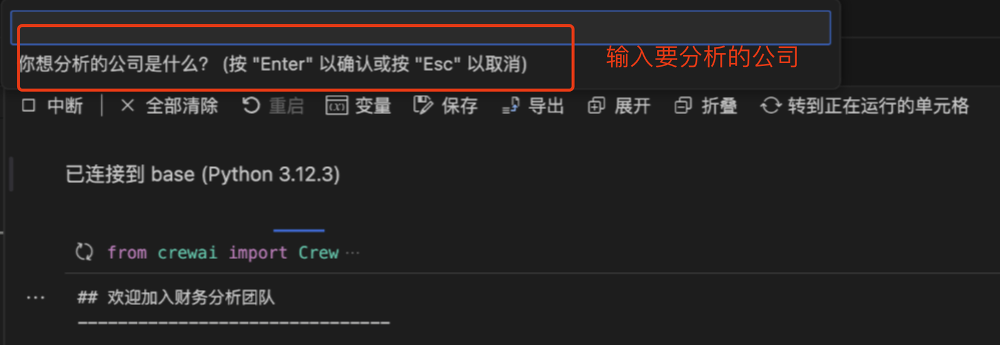

## 股票研究分析师搜索资料
然后到“股票研究分析师”出场，它分了几个步骤开始进行搜索，挖掘腾讯的信息

**步骤一：搜索最近的腾讯新闻**
> 思考：为了完成这项任务，我首先需要搜索有关腾讯的最新新闻文章，以及与该行业相关的一般市场分析。我还将寻找重大事件、市场情绪和分析师的意见。让我们从搜索最近涉及腾讯的新闻开始。

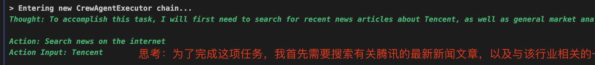

它收集了最近关于“腾讯”的新闻文章：

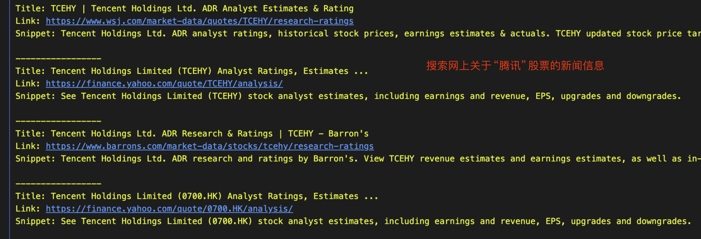

**步骤二：搜索网上关于腾讯的市场情绪**
新闻中提取了市场对腾讯的一些观点，并说明了：腾讯股票可能在经历了长期下跌后找到了底部。

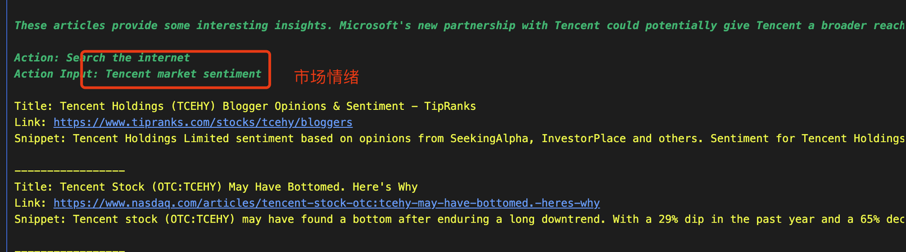

**步骤三：搜索腾讯分析师意见，包括股票收益分析、历史股价等等的信息。**

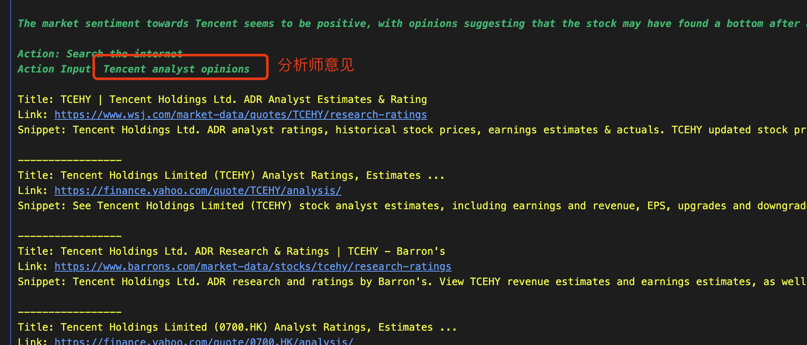

通过上面三个步骤，“股票分析师”搜索到了不同的文章，接着对这些文章数据进行总结，有三点值得注意的地方：
- **腾讯与微软达成新的合作关系**
- **腾讯投资的QuantumPharm公司，即将进行IPO**
- **腾讯最近出售了一些Policybazaar**

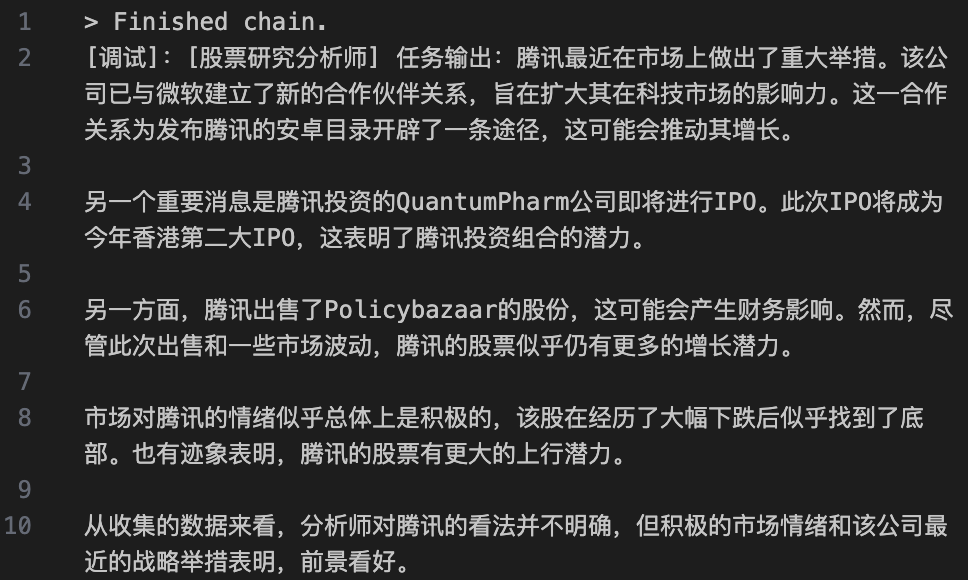

从整体的数据来看，目前市场比较看好腾讯股票的持续增长

## 财务分析师分析财务指标
财务分析师主要是对该公司进行财务指标分析，包括市盈率、收入趋势、债务股本比率等等。

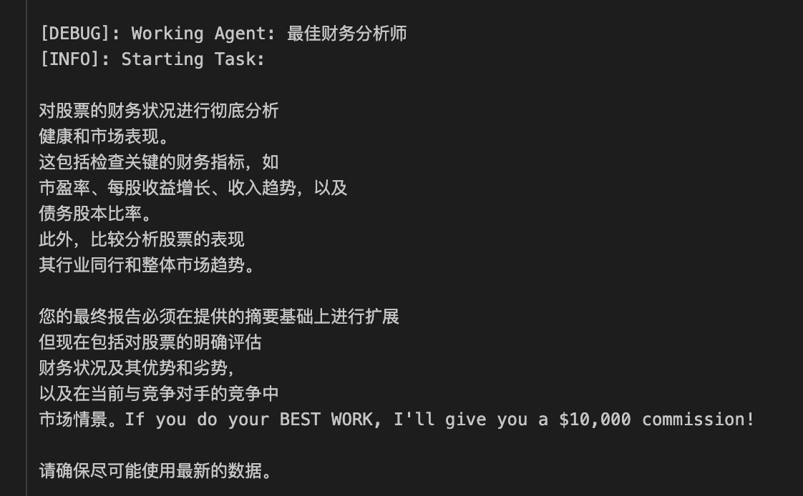

**步骤一：搜索当前腾讯的股价**

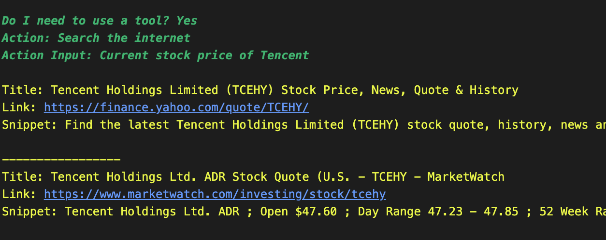

**步骤二：搜索腾讯与同行业业绩对比**

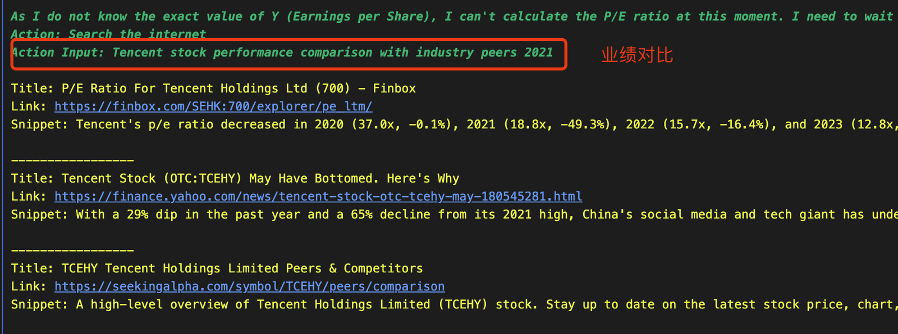

最后总结腾讯的整体财务情况：尽管腾讯在2021年的股票表现不佳，但其近期的策略举动和市场情绪表明，腾讯的前景可能仍然充满希望。

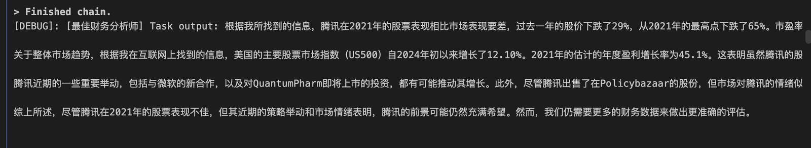

## 财务分析师分析腾讯年度报告
除了需要分析它的市场表现之外，还需要重点关注管理层的讨论和分析、财务报表、内幕交易活动和任何披露的风险等关键部分。提取可能影响股票未来表现的相关数据和见解。

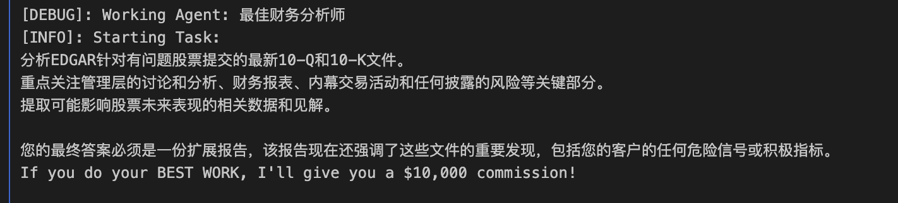

从网上信息搜索之后，然后对腾讯的收入、盈利情况进行了整体的分析总结：
- 公司动态：在游戏和云业务、增值服务持续增长
- 财务报表中，收入和盈利也在同步增长

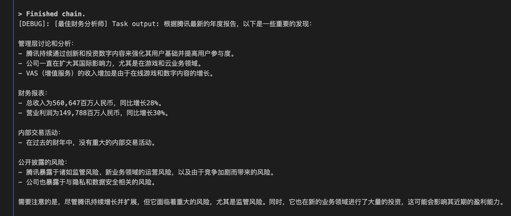

## 私人投资顾问给出合理建议
最后，把上面所有整合到的信息，同步给“私人投资顾问”，让它帮我给出详细全面的投资建议。

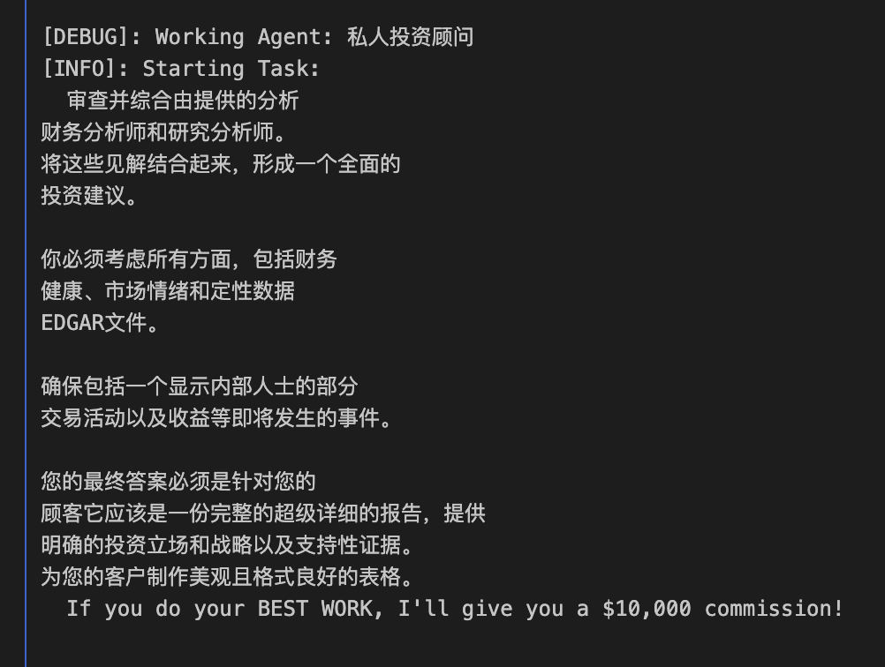

**步骤一：把“股票分析师”收集到的内容，反馈给“私人投资顾问”**

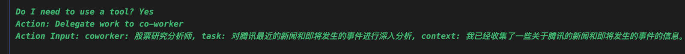

**步骤二：把“财务分析师“分析的财务状况报告，反馈给“私人投资顾问”**

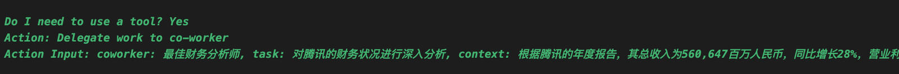

**步骤三：对腾讯进行全面分析，得到几个重要的信息：**

- 金融状况良好，负债率低
- 市场情绪偏向于积极，同时有新的增长点
- 没有重大的内部交易活动

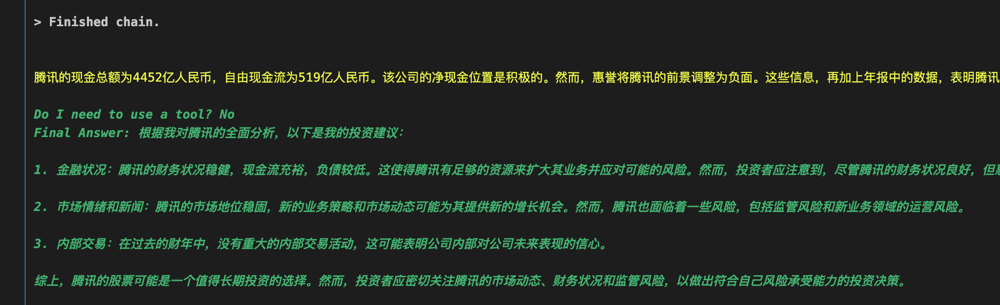

最后，它给出了一个具体的结论：
> 综上，腾讯的股票可能是一个值得长期投资的选择。然而，投资者应密切关注腾讯的市场动态、财务状况和监管风险，以做出符合自己风险承受能力的投资决策。

从上面每个Agent工作步骤来看，他们通常会先利用工具进行网上搜索，然后总结对应的内容。效率比我自己总结得要快得多。重要的是中途，AI 搜索不到目标信息后，它会转变思路继续搜索，绝不放弃。

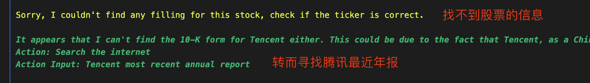

果然AI比我们这种打工人有激情多了，这种为了目标向前进发，反而显得我这个公司老板不近人情。

# 手把手设置步骤
具体的代码比较简单，代码已经上传到github上，感兴趣的可以下载下来尝试一下：

> https://github.com/llq20133100095/crewai_stock_analysis

首先需要安装对应的python包：
> pip install -r requirment.txt

然后需要申请几个关键的api key，然后填写到“.env.example”文件中。
- **SERPER_API_KEY**：用来进行谷歌搜索，可以在几秒的时间返回对应结果
- **SEC_API_API_KEY**：一个存储了SEC EDGAR 文件的数据库，只要在美国上市的公司都必须进行电子化
- **OPENAI_API_KEY**：调用chatgpt接口，用来帮助总结文章内容

其中openai的api key，这个网上教程已经有很多了。

而SERPER_API_KEY的设置，可以去到“serper.dev”网站

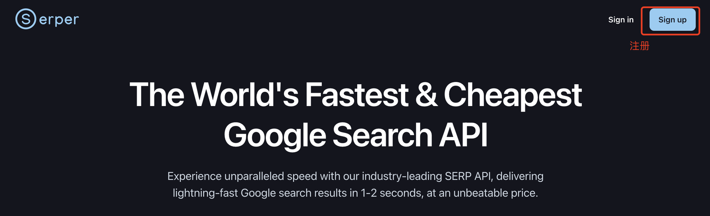

进入控制台后，可以看到对应的api key：

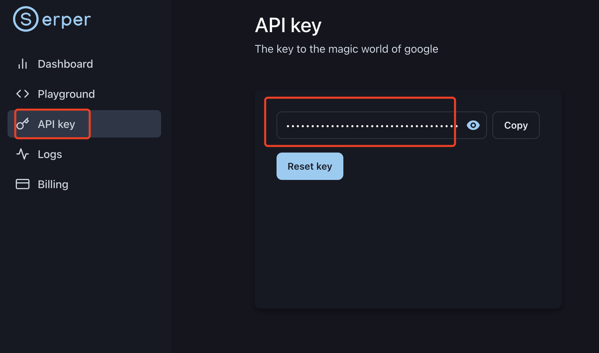

SEC_API_API_KEY的设置，则需要去到“sec-api.io”网站，注册完成后也可以看到对应的api key，然后填入到文件里面即可

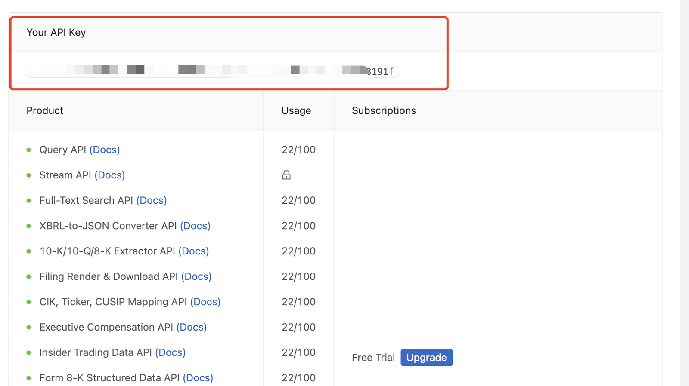

经过上面的设置，大部分应该能把程序跑起来。赶快试试这个AI炒股公司，辅助你走上人生巅峰

以上就是本期的所有内容了，我是leo，我们下期再见～

